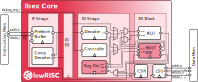

# Ibex RISC-V Core

Ibex is a production-quality open source 32-bit RISC-V CPU core written in
SystemVerilog. The CPU core is heavily parametrizable and well suited for
embedded control applications. Ibex is being extensively verified and has
seen multiple tape-outs. Ibex supports the Integer (I) or Embedded (E),
Integer Multiplication and Division (M), Compressed (C), and B (Bit
Manipulation) extensions.

The block diagram below shows the *small* parametrization with a 2-stage
pipeline.

Ibex was initially developed as part of the [PULP platform](https://www.pulp-platform.org)
under the name ["Zero-riscy"](https://doi.org/10.1109/PATMOS.2017.8106976), and has been
contributed to [lowRISC](https://www.lowrisc.org) who maintains it and develops it further. It is
under active development.

## Configuration

Ibex offers several configuration parameters to meet the needs of various application scenarios.
The options include different choices for the architecture of the multiplier unit, as well as a range of performance and security features.
The table below indicates performance, area and verification status for a few selected configurations.
These are configurations on which lowRISC is focusing for performance evaluation and design verification (see [supported configs](ibex_configs.yaml)).

| Config | "micro" | "small" | "maxperf" | "maxperf-pmp-bmfull" |
| ------ | ------- | --------| ----------| -------------------- |
| Features | RV32EC | RV32IMC, 3 cycle mult | RV32IMC, 1 cycle mult, Branch target ALU, Writeback stage | RV32IMCB, 1 cycle mult, Branch target ALU, Writeback stage, 16 PMP regions |
| Performance (CoreMark/MHz) | 0.904 | 2.47 | 3.13 | 3.13 |
| Area - Yosys (kGE) | 16.85 | 26.60 | 32.48 | 66.02 |
| Area - Commercial (estimated kGE) | ~15 | ~24 | ~30 | ~61 |
| Verification status | Red | Green | Amber | Amber |

Notes:

* Performance numbers are based on CoreMark running on the Ibex Simple System [platform](examples/simple_system/README.md).
  Note that different ISAs (use of B and C extensions) give the best results for different configurations.
  See the [Benchmarks README](examples/sw/benchmarks/README.md) for more information.
* Yosys synthesis area numbers are based on the Ibex basic synthesis [flow](syn/README.md) using the latch-based register file.
* Commercial synthesis area numbers are a rough estimate of what might be achievable with a commercial synthesis flow and technology library.
* For comparison, the original "Zero-riscy" core yields an area of 23.14kGE using our Yosys synthesis flow.
* Verification status is a rough guide to the overall maturity of a particular configuration.
  Green indicates that verification is close to complete.
  Amber indicates that some verification has been performed, but the configuration is still experimental.
  Red indicates a configuration with minimal/no verification.
  Users must make their own assessment of verification readiness for any tapeout.
* v.1.0.0 of the RISC-V Bit-Manipulation Extension is supported as well as the remaining sub-extensions of draft v.0.93 of the bitmanip spec.
  The latter are *not ratified* and there may be changes before ratification.
  See [Standards Compliance](https://ibex-core.readthedocs.io/en/latest/01_overview/compliance.html) in the Ibex documentation for more information.

## Documentation

The Ibex user manual can be
[read online at ReadTheDocs](https://ibex-core.readthedocs.io/en/latest/). It is also contained in
the `doc` folder of this repository.

## Examples

The Ibex repository includes [Simple System](examples/simple_system/README.md).
This is an intentionally simple integration of Ibex with a basic system that targets simulation.
It is intended to provide an easy way to get bare metal binaries running on Ibex in simulation.

A more complete example can be found in the [Ibex Super System repository](https://github.com/GregAC/ibex_super_system).
In particular it includes a integration of the [PULP RISC-V debug module](https://github.com/pulp-platform/riscv-dbg).
It targets the [Arty A7 FPGA board from Digilent](https://digilent.com/shop/arty-a7-artix-7-fpga-development-board/) and supports debugging via OpenOCD and GDB over USB (no external JTAG probe required).
The Ibex Super System is written by lowRISC but is not an official part of Ibex, nor officially supported by lowRISC.

## Contributing

We highly appreciate community contributions. To ease our work of reviewing your contributions,
please:

* Create your own branch to commit your changes and then open a Pull Request.
* Split large contributions into smaller commits addressing individual changes or bug fixes. Do not
  mix unrelated changes into the same commit!
* Write meaningful commit messages. For more information, please check out the [contribution
  guide](https://github.com/lowrisc/ibex/blob/master/CONTRIBUTING.md).
* If asked to modify your changes, do fixup your commits and rebase your branch to maintain a
  clean history.

When contributing SystemVerilog source code, please try to be consistent and adhere to [our Verilog
coding style guide](https://github.com/lowRISC/style-guides/blob/master/VerilogCodingStyle.md).

When contributing C or C++ source code, please try to adhere to [the OpenTitan C++ coding style
guide](https://docs.opentitan.org/doc/rm/c_cpp_coding_style/).
All C and C++ code should be formatted with clang-format before committing.
Either run `clang-format -i filename.cc` or `git clang-format` on added files.

To get started, please check out the ["Good First Issue"
 list](https://github.com/lowrisc/ibex/issues?q=is%3Aissue+is%3Aopen+label%3A%22Good+First+Issue%22).

## Issues and Troubleshooting

If you find any problems or issues with Ibex or the documentation, please check out the [issue
 tracker](https://github.com/lowrisc/ibex/issues) and create a new issue if your problem is
not yet tracked.

## Questions?

Do not hesitate to contact us, e.g., on our public [Ibex channel on
Zulip](https://lowrisc.zulipchat.com/#narrow/stream/198227-ibex)!

## License

Unless otherwise noted, everything in this repository is covered by the Apache
License, Version 2.0 (see LICENSE for full text).

## Credits

Many people have contributed to Ibex through the years. Please have a look at
the [credits file](CREDITS.md) and the commit history for more information.

# SBST on ibex Core - TFT Assignment

## 🎯 Goal 🎯
The objective of your assignment is to produce functional stimulus (i.e., assembly code) able to detect stuck-at faults in the hierarhical design of the `ibex` core. The implementation of `ibex` that you are targeting is the `"maxperf"` and consists of the following extensions:

| Symbol | Context                     | 
|:------:|-----------------------------|
| RV32I  | Base integer isa            |
| M      | Multiplication and Division |
| C      | Compressed instructions     |
|        |                             | 

For your convenience, here is an extended table with all the instructions supported per ISA extension: 

>📜 RV32I:

| Instruction | Name                            | Format         | Description                  | Note |
|-------------|---------------------------------|----------------|------------------------------|------|
| add         | ADD                             | R              | rd = rd1 + rs2               |      |
| sub         | SUB                             | R              | rd = rs1 - rs2               |      |
| xor         | XOR                             | R              | rd = rs1 ⊕ rs2              |      |
| or          | OR                              | R              | rd = rs1 V rs2               |      |
| and         | AND                             | R              | rd = rs1 Λ rs2               |      |
| sll         | Shift Left Logical              | R              | rd = rs1 << rs2              |      |
| srl         | Shift Right Logical             | R              | rd = rs1 >> rs2              |      |
| sra         | Shift Right Arithmetic          | R              | rd = rs1 >> rs2| MSB Extends |      |
| slt         | Set Less Than                   | R              | rd = (rs1 < rs2) ? 1 : 0     |      |
| sltu        | Set Less Than Unsigned          | R              | rd = (rs1 < rs2) ? 1 : 0     | Zero Extends |
| addi        | ADD Immediate                   | I              | rd = rs1 + imm               |      |
| xori        | XOR Immediate                   | I              | rd = rs1 ⊕ imm              |      |
| ori         | OR  Immediate                   | I              | rd = rs1 V imm               |      |
| andi        | AND Immediate                   | I              | rd = rs1 Λ imm               |      |
| slli        | Shift Left Logical Immediate    | I              | rd = rs1 << imm              |      |
| srli        | Shift Right Logical Immediate   | I              | rd = rs1 >> imm              |      |
| srai        | Shift Right Arithmetic Immediate| I              | rd = rs1 >> imm              | MSB Extends |
| slti        | Set Less Than Immediate         | I              | rd = (rs1 < imm) ? 1 : 0     |      |
| sltui       | Set Less Than Unsigned Immediate| I              | rd = (rs1 < imm) ? 1 : 0     | Zero Extends |
| lb          | Load Byte                       | I              | rd = M[rs1+imm][0:7]         | |
| lh          | Load Half                       | I              | rd = M[rs1+imm][0:15]        | |
| lw          | Load Word                       | I              | rd = M[rs1+imm][0:31]        | |
| lbu         | Load Byte Unsigned              | I              | rd = M[rs1+imm][0:7]         | Zero Extends |
| lhu         | Load Half Unsigned              | I              | rd = M[rs1+imm][0:15]        | Zero Extends | 
| sb          | Store Byte                      | S              | M[rs1+imm][0:7] = rs2[0:7]|  |
| sh          | Store Half                      | S              | M[rs1+imm][0:15] = rs2[0:15] | |
| sw          | Store Word                      | S              | M[rs1+imm][0:31] = rs2[0:31] | |
| beq         | Branch if Equals (==)           | B              | PC = (rs1==rs2) ? PC+imm : PC+4 | |
| bne         | Branch if Not Equals (!=)       | B              | PC = (rs1!=rs2) ? PC+imm : PC+4 | |
| blt         | Branch if Less (<)              | B              | PC = (rs1<rs2) ? PC+imm : PC+4 | |
| bge         | Branch if Greater Equals (>=)   | B              | PC = (rs1>=rs2) ? PC+imm : PC+4 | |
| bltu        | Branch if Less Unsigned (<)     | B              | PC = (rs1<rs2) ? PC+imm : PC+4 | Zero Extends |
| bgeu        | Branch if Greater Equals (>=)   | B              | PC = (rs1>=rs2) ? PC+imm : PC+4 | Zero Extends | 
| jal         | Jump and Link                   | J              | rd = PC + 4; PC += imm | | 
| jalr        | Jump and Link Register          | J              | rd = PC+4; PC = rs1 +imm | | 
| lui         | Load Upper Immediate            | U              | rd = imm << 12 | |
| auipc       | Add Upper Immediate to PC       | U              | rd = PC + ( imm << 12) | |
| ecall       | Environment Call                | I              | Transfer control to OS | |
| ebreak      | Environment Call                | I              | Transfer control to Debugger || 

>📜 M:

| Instruction | Name                     | Format         | Description           | Note |
|-------------|--------------------------|----------------|-----------------------|------|
| mul         | MUL                      | R              | rd = (rs1*rs2)[31:0]  |      |
| mulh        | MUL High                 | R              | rd = (rs1*rs2)[63:32] |      |
| mulsu       | MUL High Signed Unsigned | R              | rd = (rs1*rs2)[63:32] |      |
| mulu        | MUL High Unsigned        | R              | rd = (rs1*rs2)[63:32] |      |
| div         | DIV                      | R              | rd = rs1 / rs2        |      |
| divu        | DIV Unsigned             | R              | rd = rs1 / rs2        |      |
| rem         | Remainder                | R              | rd = rs1 % rs2        |      |
| remu        | Remainder Unsigned       | R              | rd = rs1 % rs2        |      |

>📜 C: 

| Instruction | Name                     | Format         | Description           | Note |
|-------------|--------------------------|----------------|-----------------------|------|
| c.lwsp      | Load Word from SP        | CI             | lw rd, (4*imm)(sp)    |      |
| c.swsp      | Store Word to SP         | CSS            | sw rs2, (4*imm)(sp)   |      |
| c.lw        | Load Word                | CL             | lw rd’, (4*imm)(rs1’) |      |
| c.sw        | Store Word               | CS             | sw rs1’, (4*imm)(rs2’)|      |
| c.j         | Jump                     | CJ             | jal x0, 2*offset      |      |
| c.jal       | Jump And Link            | CJ             | jal ra, 2*offset      |      |
| c.jr        | Jump Reg                 | CR             | jalr x0, rs1, 0       |      |
| c.jalr      | Jump And Link Reg        | CR             | jalr ra, rs1, 0       |      |
| c.beqz      | Branch == 0              | CB             | beq rs’, x0, 2*imm    |      |
| c.bnez      | Branch != 0              | CB             | bne rs’, x0, 2*imm    |      |
| c.li        | Load Immediate           | CI             | addi rd, x0, imm      |      |
| c.lui       | Load Upper Imm           | CI             | lui rd, imm           |      |
| c.addi      | ADD Immediate            | CI             | addi rd, rd, imm      |      |
| c.addi16sp  | ADD Imm * 16 to SP       | CI             | addi sp, sp, 16*imm   |      |
| c.addi4spn  | ADD Imm * 4 + SP         | CIW            | addi rd’, sp, 4*imm   |      |
| c.slli      | Shift Left Logical Imm   | CI             | slli rd, rd, imm      |      |
| c.srli      | Shift Right Logical Imm  | CB             | srli rd’, rd’, imm    |      |
| c.srai      | Shift Right Arith Imm    | CB             | srai rd’, rd’, imm    |      |
| c.andi      | AND Imm                  | CB             | andi rd’, rd’, imm    |      |
| c.mv        | Move                     | CR             | add rd, x0, rs2       |      |
| c.add       | ADD                      | CR             | add rd, rd, rs2       |      |
| c.and       | AND                      | CS             | and rd’, rd’, rs2’    |      |
| c.or        | OR                       | CS             | or rd’, rd’, rs2’     |      |
| c.xor       | XOR                      | CS             | xor rd’, rd’, rs2’    |      |
| c.sub       | SUB                      | CS             | sub rd’, rd’, rs2’    |      |
| c.nop       | No OPeration             | CI             | addi x0, x0, 0        |      |
| c.ebreak    | Environment BREAK        | CR             | ebreak                |      |

For information about the assembly syntax, formats of instructions etc. advise the following links: 
1. [Assembly OPs, Directives & PseudoOps](https://github.com/riscv-non-isa/riscv-asm-manual/blob/master/riscv-asm.md)
2. [The RISC-V Instruction Set Manual](https://riscv.org/wp-content/uploads/2019/12/riscv-spec-20191213.pdf)

>**Requirement: The achieved fault coverage should be at least 85%** 

## Package Utilities 

All the supported utilities are orchestrated by the `Makefile` in this directory. All of your actions MUST be using the makefile recipes. Use `make help` to display the available functionalities. 

### Logic simulation
We support two types of logic simulation. 
  1. RTL simulation
  2. Gate-Level simulation

Both of these, come with `gui` and `shell` variants. Use the `RTL` simulation to familiarize yourself with the design, verify and validate your assembly and to observe the pipeline behavior in general. The `RTL` simulation in gui mode also includes a tracer. 

By specifying during the simulation `MEMDEBUG="+memory_debug"` you can also have increased verbosity and display of every memory transaction (both for instruction memory and also for data memory).

For the testing purposes of course, we are going to need the **Gate-Level** variant and **not** the `RTL`. 

During logic simulation, under the `run/` directory you will find a `.vcd` file generated which will be the stimulus/patterns for the fault simulation later on (as we have seen also in the laboratory exercises).

### Assembly 

Use the information above to write your test routines. All your code should be inside the `/sbst/sbst.S` file. There exists already a boilerplate file for your convenience. Write code in the designated area. 

Use `make xcompile` to cross-compile your code and to generate the `.hex` file to be used for the logic simulation purposes. 

In order to exit from the routine use the macro `EXIT rX` that is in the top of the file. It is used to terminate the code.

### Stuck-At Fault Simulation 

The Fault simulator we are going to use is `Z01X`. The steps for the simulation are the following one 

1. `make compile/zoix`: Compile the gate-level module
2. `make fsim/zoix/fgen`:  Generate the stuck-at fault list 
3. `make fsim/zoix/lsim VCD=...`: Logic simulation to check for missmatched 
4. `make fsim/zoix/fsim VCD=...`: Fault simulation 

The results of the fault simulation will be under the `/run` directory.
